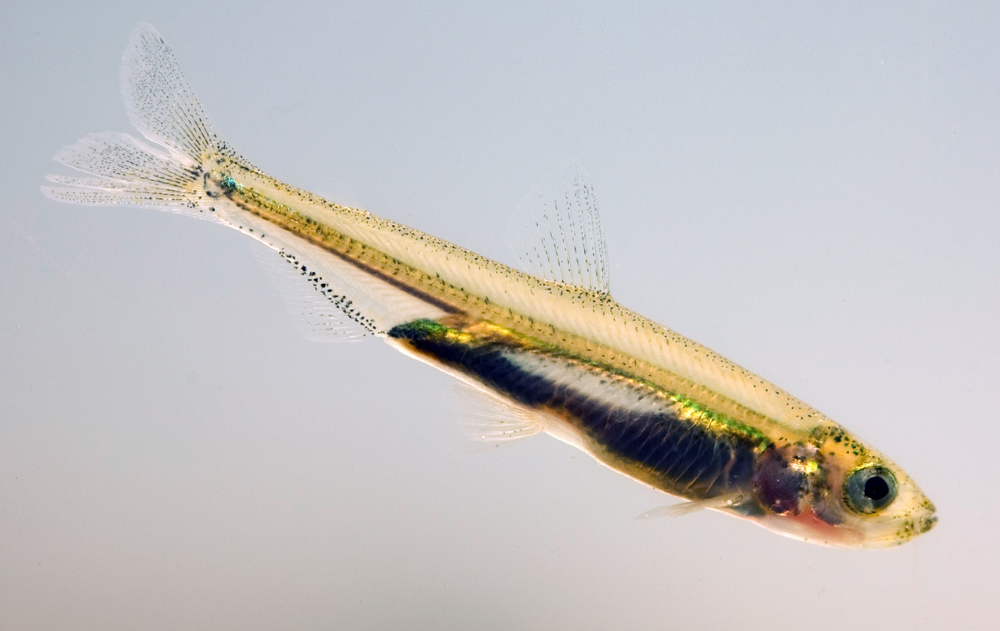
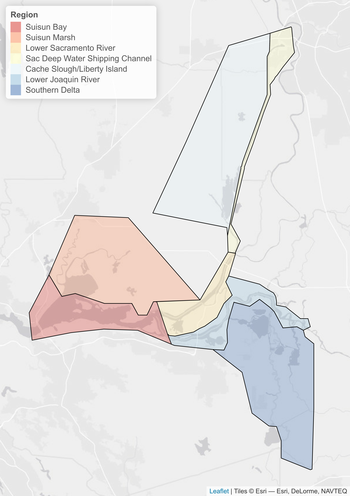

```{r setup, include=FALSE, echo=FALSE}
knitr::opts_chunk$set(echo = F, warning = FALSE, fig.height=4, fig.width=7.5, fig.align="center", fig.pos='H')

require(tibble)
require(knitr)
require(DT)
require(dplyr)
require(deltareportr)

create_dt <- function(x, caption=NULL){
  DT::datatable(x,
                rownames = FALSE,
                caption = caption,
                extensions = 'Buttons',
                options = list(dom = 'Blfrtip',
                               buttons = c('csv'),
                               lengthMenu = list(c(10,25,50,-1),
                                                 c(10,25,50,"All")),
                               columnDefs = list(list(className = 'dt-right', targets="_all"))))
}

End_year=2019

Data <- DeltaDater()

WQ <- DeltaWQer(Data$Water_quality, End_year=End_year)
DF <- DeltaDayFlower(End_year=End_year)
PH <- DeltaPhyter(Data$Phytoplankton, End_year=End_year)
FISH <- DeltaSmelter(End_year=End_year)
META <- DeltaMetadater(Data)
ZOOP <- DeltaZooper(Data$Zooplankton, End_year=End_year)
BIV <- DeltaBivalver(Data$Bivalves, End_year=End_year)

if(params$Map=="Yes"){
  DeltaMapper(Save=TRUE,
            Save_location="figures/map.png")
}
```

<br>

# Accessibility

For any assistance accessing the map, graphs, images, or other material in this report, please contact us at [accessibility@deltacouncil.ca.gov](mailto:accessibility@deltacouncil.ca.gov?subject=Delta%20Smelt%20Conditions%20Report).

# Introduction

This report is intended for managers and scientists interested in tracking environmental conditions considered important for Delta Smelt (*Hypomesus transpacificus*). The variables shown in this report represent a selected subset of the variables that have been incorporated into conceptual models of Delta Smelt life history and analyses of the Delta Smelt population and its habitat. The variables selected have also been consistently measured as part of the long term monitoring efforts of the Interagency Ecological Program and other entities. Data for selected variables are summarized from 2002 to present, to reflect conditions since the beginning of the Pelagic Organism Decline. The report does not include data from short-term special studies. This report also does not provide detailed assessments of trends or the outcomes of specific management actions. Such assessments require specialized analysis and synthesis by expert teams and are beyond the scope of this report.

Delta Smelt is a pelagic species that prefers cooler temperatures (< 22 &deg;C) in low salinity (0 - 6 PSU), turbid habitats. Some additional habitat concerns are food availability, invasive species, contaminants and harmful algal blooms.

Delta Smelt is generally described as a semi-anadromous species, moving from brackish low salinity (0.5-6 PSU) habitats to tidal fresh water habitats to spawn; however, the species expresses a variety of life histories. These spawning movements generally occur in the winter, after the “first-flush” of turbid freshwater following the first major precipitation event. A variable proportion of the population also exhibit resident life histories, residing in freshwater or brackish water for their entire life cycle.

Since the POD (Pelagic Organism Decline, 2002-2003), Delta Smelt have been most commonly found in the North Delta region (Cache Slough/Liberty Island and Sacramento River Deep Water Shipping Channel) during the winter spawning season. Larval and juvenile fish of the migratory life history move into low salinity habitat (Suisun Bay and Marsh, Lower Sacramento River) during the spring and early summer and remain there until their winter spawning movements into fresh water. The Lower San Joaquin River and Southern Delta are highly modified habitats characterized by warm summer temperatures and low turbidities with low abundance of Delta Smelt. Proximity to the water export facilities, which may result in some probability of entrainment under some environmental conditions and operations, may also be a factor.

<br>

(ref:DeltaSmeltphoto) Juvenile Delta Smelt Dale Kolke / DWR.

```{r DeltaSmeltphoto, echo=FALSE, fig.cap="(ref:DeltaSmeltphoto)", out.width="55%"}

```


# Methods

Most variables are divided among 7 of the 8 regions from the [Enhanced Delta Smelt Monitoring (EDSM)](https://www.fws.gov/lodi/juvenile_fish_monitoring_program/jfmp_index.htm) 2018-19 phase I strata, with the Western Delta region excluded because it is almost never occupied by Delta Smelt. Missing data are denoted by vertical dashed lines. Data are plotted from 2002 (or the start of data collection) until present. Graphs are available for all four seasons of each variable (except Outflow, X2, and Delta Smelt abundance, which are each plotted as a single contiguous time series). Note that y-axis scales are different for each season. The most important season for each variable are shown by default and the other seasons must be opened by clicking the arrow symbol. The most important season is determined from the literature as the season when a selected variable is most critical in the life history of Delta Smelt. While the most recent available data are included, the graphs highlight in red the report year - the most recent year with available data for all variables. This report will be produced annually. 

(ref:Deltamap) The Sacramento San Joaquin Delta divided into the EDSM 2018-19 phase I strata (Suisun Bay, Suisun Marsh, Lower Sacramento River, Sacramento Deep Water Shipping Channel, Cache Slough/Liberty Island, Lower San Joaquin River, and the Southern Delta).

```{r Deltamap, echo=FALSE, out.width="55%", fig.cap="(ref:Deltamap)"}

```


## Sampling programs

```{r Sampleprog}
knitr::kable(tibble::tibble(Acronym = c("EMP", "FMWT", "SKT", "STN", "20mm", "EDSM", "Suisun", "Dayflow"), `Dataset name` = c("Environmental Monitoring Program", "Fall Midwater Trawl", "Spring Kodiak Trawl", "Summer Townet", "20 mm Survey", "Enhanced Delta Smelt Monitoring", "Suisun Marsh Fish Study", "Dayflow"), Agency = c("California Department of Fish and Wildlife; Department of Water Resources", "California Department of Fish and Wildlife", "California Department of Fish and Wildlife", "California Department of Fish and Wildlife", "California Department of Fish and Wildlife", "United States Fish and Wildlife Service","University of California, Davis", "Department of Water Resources")), caption="Acronyms and responsible agencies for each dataset used in this report.")
```


## Definitions of seasons

```{r Seasons}
knitr::kable(tibble(Season = c("Winter", "Spring", "Summer", "Fall"), Months = c("December (of prior year), January, February", "March, April, May", "June, July, August", "September, October, November")), caption = "Definitions of seasons as used in this report.")
```

## Sampling effort

(ref:Metadatafigure) Average yearly sampling effort for each variable, region, season, and survey. Cyanobacteria data are included in the phytoplankton category. Delta Outflow and X2 are derived from the Dayflow model while Delta Smelt abundance is represented by the official indices produced by FMWT, SKT, STN, 20mm, and EDSM. Raw data are available in <a href="#tab:Metadatadata"> table 3.</a>


```{r Metadatafigure, echo=FALSE, fig.height=8, fig.cap="(ref:Metadatafigure)"}
META$Plot
```

# Abiotic drivers

## Delta outflow

Delta Smelt abiotic habitat (as defined by salinity, turbidity, and water temperature) is determined largely by freshwater flow because Delta Smelt occupy the fresh, and low salinity portion of the SFE during the summer and fall. **High Delta outflow in the summer-fall increases the amount of low salinity habitat available in Suisun Bay and Suisun Marsh. This is thought to be favorable for Delta Smelt.** High outflow may also improve other abiotic environmental conditions and reduce harmful algal blooms.

(ref:Outflow) Monthly modeled Delta outflow from the Dayflow model. Fall months are highlighted in orange. Raw data are available in <a href="#tab:Dayflowdata"> table 4.</a>

```{r Outflow, fig.height=3.7, fig.cap="(ref:Outflow)"}
DF$Plots$Out
```

## X2

X2 is a measure of the location of low salinity habitat. X2 is defined as the horizontal distance in kilometers from the Golden Gate up the axis of the estuary to where tidally averaged near-bottom salinity is 2. X2 is used as a proxy for the amount of low salinity habitat in the Delta; **lower X2 in the fall generally means more low salinity habitat is available**. 

(ref:X2) Monthly modeled X2 from the Dayflow model. Fall months are highlighted in orange. Raw data are available in <a href="#tab:Dayflowdata"> table 4.</a>

```{r X2, fig.height=3.7, fig.cap="(ref:X2)"}
DF$Plots$X2
```

## Temperature {#Temperaturegraphs}

Delta Smelt are sensitive to high water temperatures. Results from laboratory and observational studies suggest that **Delta Smelt growth is optimal at water temperatures &le; 20 &deg;C**, growth likely declines at 20-22 &deg;C with poor growth at 22-24 &deg;C, and the onset of physiological stress around 24 &deg;C (Brown et al. 2016, FLOAT-MAST in review). Chronic exposure to water temperatures above 26 &deg;C are likely fatal. Delta Smelt are rarely captured above 22 &deg;C.

(ref:Temperature) Mean seasonal water temperature from discrete measurements collected by the 20mm, EDSM, EMP, FMWT, SKT, STN, and Suisun surveys, shaded by suitability for Delta Smelt (bottom blue section under 20 &deg;C = good, middle yellow section between 20 and 22 &deg;C  = marginal, top red section over 22 &deg;C = bad). Gray shading represents the standard deviation across all measurements from the specified season of each year. Vertical dotted lines represent years with missing data. Raw data are available in <a href="#tab:Temperaturedata"> table 5.</a>

(ref:TemperatureB) Mean seasonal water temperature from discrete measurements collected by the 20mm, EDSM, EMP, FMWT, SKT, STN, and Suisun surveys. Gray shading represents the standard deviation across all measurements from the specified season of each year. Vertical dotted lines represent years with missing data. Raw data are available in <a href="#tab:Temperaturedata"> table 5.</a>

<details>
  <summary>**Winter**</summary>
```{r Temperature-Winter, fig.height=7, fig.cap="(ref:TemperatureB)"}
WQ$Temperature$Plot$Winter
```
</details> 

<details>
  <summary>**Spring**</summary>
```{r Temperature-Spring, fig.height=7, fig.cap="(ref:TemperatureB)"}
WQ$Temperature$Plot$Spring
```
</details> 

<details open>
  <summary>**Summer**</summary>
```{r Temperature-Summer, fig.height=7, fig.cap="(ref:Temperature)"}
WQ$Temperature$Plot$Summer
```
</details> 

<details>
  <summary>**Fall**</summary>
```{r Temperature-Fall, fig.height=7, fig.cap="(ref:Temperature)"}
WQ$Temperature$Plot$Fall
```
</details> 

## Secchi depth {#Secchigraphs}

Secchi depth is a measure of turbidity. **Lower Secchi depth indicates higher turbidity, which is preferred by Delta Smelt**. Delta Smelt distributions are clustered around areas with low Secchi depth (high turbidity) in the fall. Delta Smelt evolved in the historically turbid San Francisco Estuary and the larvae rely on this turbidity to effectively feed and hide from predators. 

(ref:Secchi) Mean seasonal Secchi depth from the 20mm, EDSM, EMP, FMWT, SKT, STN, and Suisun surveys. Means were calculated by pooling discrete measurements of the three surveys for the specified season of each year. Gray shading represents the standard deviation across all measurements from the specified season of each year. Raw data are available in <a href="#tab:Secchidata"> table 6.</a>

<details>
  <summary>**Winter**</summary>
```{r Secchi-Winter, fig.height=7, fig.cap="(ref:Secchi)"}
WQ$Secchi$Plot$Winter
```
</details> 

<details>
  <summary>**Spring**</summary>
```{r Secchi-Spring, fig.height=7, fig.cap="(ref:Secchi)"}
WQ$Secchi$Plot$Spring
```
</details> 

<details>
  <summary>**Summer**</summary>
```{r Secchi-Summer, fig.height=7, fig.cap="(ref:Secchi)"}
WQ$Secchi$Plot$Summer
```
</details> 

<details open>
  <summary>**Fall**</summary>
```{r Secchi-Fall, fig.height=7, fig.cap="(ref:Secchi)"}
WQ$Secchi$Plot$Fall
```
</details> 

## Salinity {#Salinitygraphs}

**During the fall, Delta Smelt prefer fresh to brackish water, are most abundant in salinities less than about 6 PSU**, decline in abundance at higher salinities, and become rare at salinities above about 14 PSU. Juveniles rely on freshwater and low salinity habitat in the fall to feed, grow, and mature into adults. 

(ref:Salinity) Mean seasonal salinity from the 20mm, EMP, FMWT, SKT, STN, and Suisun surveys. Means were calculated by pooling discrete measurements of the two surveys for the specified season of each year. Gray shading represents the standard deviation across all measurements from the specified season of each year. Raw data are available in <a href="#tab:Salinitydata"> table 7.</a>

<details>
  <summary>**Winter**</summary>
```{r Salinity-Winter, fig.height=7, fig.cap="(ref:Salinity)"}
WQ$Salinity$Plot$Winter
```
</details> 

<details>
  <summary>**Spring**</summary>
```{r Salinity-Spring, fig.height=7, fig.cap="(ref:Salinity)"}
WQ$Salinity$Plot$Spring
```
</details> 

<details>
  <summary>**Summer**</summary>
```{r Salinity-Summer, fig.height=7, fig.cap="(ref:Salinity)"}
WQ$Salinity$Plot$Summer
```
</details> 

<details open>
  <summary>**Fall**</summary>
```{r Salinity-Fall, fig.height=7, fig.cap="(ref:Salinity)"}
WQ$Salinity$Plot$Fall
```
</details> 

# Biotic drivers

## Chlorophyll concentrations {#Chlorophyllgraphs}

Chlorophyll is a measure of productivity at the base of the food web. **Higher chlorophyll is an indicator of more food availability for zooplankton, which are important prey for many fish, including Delta Smelt.** 

(ref:Chlorophyll) Mean seasonal chlorophyll concentrations from EMP. Means were calculated by pooling discrete measurements for the specified season of each year. No data are available from the Sac Deep Water Shipping Channel or Cache/Slough/Liberty Island regions. Gray shading represents the standard deviation across all measurements from the specified season of each year. Raw data are available in <a href="#tab:Chlorophylldata"> table 8.</a>

<details>
  <summary>**Winter**</summary>
```{r Chlorophyll-Winter, fig.height=3.8, fig.cap="(ref:Chlorophyll)"}
WQ$Chlorophyll$Plot$Winter
```
</details> 

<details>
  <summary>**Spring**</summary>
```{r Chlorophyll-Spring, fig.height=3.8, fig.cap="(ref:Chlorophyll)"}
WQ$Chlorophyll$Plot$Spring
```
</details> 

<details>
  <summary>**Summer**</summary>
```{r Chlorophyll-Summer, fig.height=3.8, fig.cap="(ref:Chlorophyll)"}
WQ$Chlorophyll$Plot$Summer
```
</details> 

<details open>
  <summary>**Fall**</summary>
```{r Chlorophyll-Fall, fig.height=3.8, fig.cap="(ref:Chlorophyll)"}
WQ$Chlorophyll$Plot$Fall
```
</details> 

## Phytoplankton composition {#Phytoplanktongraphs}

Phytoplankton are the base of the aquatic food web. They provide food for zooplankton, which are important prey for Delta Smelt. **Diatoms and cryptophytes are currently considered the best quality zooplankton food, although other taxa may be important as well.** 

(ref:Phytoplankton) Seasonal phytoplankton community composition from EMP. Cyanobacteria are presented in <a href="#fig:Cyanobacteria"> figure 11</a>. Means were calculated by pooling discrete measurements for the specified season of each year. No data are available from the Sac Deep Water Shipping Channel or Cache/Slough/Liberty Island regions. Data are only shown from 2008 - present to reflect the time frame of consistent sample processing methodology. Values in white boxes indicate total phytoplankton abundance values that exceed the y-axis range. Vertical dotted lines represent years with missing data. Raw data are available in <a href="#tab:Phytodata"> table 9.</a>

<details>
  <summary>**Winter**</summary>
```{r Phytoplankton-Winter, fig.cap="(ref:Phytoplankton)"}
PH$Plots$Winter$Phytoplankton
```
</details> 

<details>
  <summary>**Spring**</summary>
```{r Phytoplankton-Spring, fig.cap="(ref:Phytoplankton)"}
PH$Plots$Spring$Phytoplankton
```
</details> 

<details>
  <summary>**Summer**</summary>
```{r Phytoplankton-Summer, fig.cap="(ref:Phytoplankton)"}
PH$Plots$Summer$Phytoplankton
```
</details> 

<details open>
  <summary>**Fall**</summary>
```{r Phytoplankton-Fall, fig.cap="(ref:Phytoplankton)"}
PH$Plots$Fall$Phytoplankton
```
</details> 

## Cyanobacteria {#Cyanobacteriagraphs} 

**Cyanobacteria are an unfavorable type of phytoplankton** Cyanobacteria are considered poor quality zooplankton food and can produce toxins, such as microcystins. 

(ref:Cyanobacteria) Seasonal cyanobacteria abundance from EMP. Means were calculated by pooling discrete measurements for the specified season of each year. No data are available from the Sac Deep Water Shipping Channel or Cache/Slough/Liberty Island regions. Data are only shown from 2008 - present to reflect the time frame of consistent sample processing methodology. Vertical dotted lines represent years with missing data. Raw data are available in <a href="#tab:Phytodata"> table 9.</a>

<details>
  <summary>**Winter**</summary>
```{r Cyanobacteria-Winter, fig.height=3.6, fig.cap="(ref:Cyanobacteria)"}
PH$Plots$Winter$Cyanobacteria
```
</details> 

<details>
  <summary>**Spring**</summary>
```{r Cyanobacteria-Spring, fig.height=3.6, fig.cap="(ref:Cyanobacteria)"}
PH$Plots$Spring$Cyanobacteria
```
</details> 

<details open>
  <summary>**Summer**</summary>
```{r Cyanobacteria-Summer, fig.height=3.6, fig.cap="(ref:Cyanobacteria)"}
PH$Plots$Summer$Cyanobacteria
```
</details> 

<details>
  <summary>**Fall**</summary>
```{r Cyanobacteria-Fall, fig.height=3.6, fig.cap="(ref:Cyanobacteria)"}
PH$Plots$Fall$Cyanobacteria
```
</details> 

## *Microcystis* {#Microcystisgraphs}

*Microcystis* is a toxin-producing cyanobacteria. The toxins, microcystins, are harmful to human and animal health. **_Microcystis_ toxins can directly harm zooplankton populations which may affect food resources for Delta Smelt.** Blooms occur yearly in the summer and fall.

(ref:Microcystis) Seasonal *Microcystis* bloom intensity from the EMP, FMWT, and STN surveys. Means were calculated by pooling discrete measurements from the two surveys for the specified season of each year. *Microcystis* bloom presence and intensity are measured on a qualitative scale with 5 categories: absent, low (widely scattered colonies), medium (adjacent colonies), high (contiguous colonies), and very high (concentration of contiguous colonies forming mats/scum). Vertical dotted lines represent years with missing data. Raw data are available in <a href="#tab:Microcystisdata"> table 10.</a>

<details>
  <summary>**Winter**</summary>
```{r Microcystis-Winter, fig.height=4.6, fig.cap="(ref:Microcystis)"}
WQ$Microcystis$Plot$Winter
```
</details> 

<details>
  <summary>**Spring**</summary>
```{r Microcystis-Spring, fig.height=4.6, fig.cap="(ref:Microcystis)"}
WQ$Microcystis$Plot$Spring
```
</details> 

<details open>
  <summary>**Summer**</summary>
```{r Microcystis-Summer, fig.height=4.6, fig.cap="(ref:Microcystis)"}
WQ$Microcystis$Plot$Summer
```
</details> 

<details>
  <summary>**Fall**</summary>
```{r Microcystis-Fall, fig.height=4.6, fig.cap="(ref:Microcystis)"}
WQ$Microcystis$Plot$Fall
```
</details>  

## Zooplankton {#Zooplanktongraphs}

Delta Smelt rely on zooplankton for food throughout their entire lives. **Calanoid copepods and mysids are particularly important in the diet of Delta Smelt.**

(ref:Zooplankton) Seasonal zooplankton biomass and composition from EMP. Means were calculated by pooling discrete measurements for the specified season of each year. No data are available from the Sac Deep Water Shipping Channel or Cache/Slough/Liberty Island regions. Raw data are available in <a href="#tab:Zooplanktondata"> table 11.</a>

<details>
  <summary>**Winter**</summary>
```{r Zooplankton-Winter, fig.height=3.9, fig.cap="(ref:Zooplankton)"}
ZOOP$Plot$Winter
```
</details> 

<details>
  <summary>**Spring**</summary>
```{r Zooplankton-Spring, fig.height=3.9, fig.cap="(ref:Zooplankton)"}
ZOOP$Plot$Spring
```
</details> 

<details>
  <summary>**Summer**</summary>
```{r Zooplankton-Summer, fig.height=3.9, fig.cap="(ref:Zooplankton)"}
ZOOP$Plot$Summer
```
</details>

<details open>
  <summary>**Fall**</summary>
```{r Zooplankton-Fall, fig.height=3.9, fig.cap="(ref:Zooplankton)"}
ZOOP$Plot$Fall
```
</details>

## Invasive bivalve abundance {#Bivalvegraphs}

**Invasive bivalves (clams) consume phytoplankton and zooplankton, reducing the amount of food available for fishes.** The overbite clam *Potamocorbula amurensis* invaded the estuary in 1987, prefers brackish waters, and feeds on both zooplankton and phytoplankton. The freshwater clam *Corbicula fluminea* invaded sometime before 1945, prefers freshwater, and feeds primarily on phytoplankton but can also feed on organic material in the substrate when phytoplankton are rare. 

(ref:Bivalves) Seasonal abundance of two invasive bivalve species (the overbite clam *Potamocorbula amurensis* and the freshwater clam *Corbicula fluminea*) from EMP. Means were calculated by pooling discrete measurements for the specified season of each year. No data are available from the Sac Deep Water Shipping Channel or Cache/Slough/Liberty Island regions. Raw data are available in <a href="#tab:Bivalvedata"> table 12.</a>

<details>
  <summary>**Winter**</summary>
```{r Bivalves-Winter, fig.height=4.1, fig.cap="(ref:Bivalves)"}
BIV$Plot$Winter
```
</details> 

<details>
  <summary>**Spring**</summary>
```{r Bivalves-Spring, fig.height=4.1, fig.cap="(ref:Bivalves)"}
BIV$Plot$Spring
```
</details> 

<details>
  <summary>**Summer**</summary>
```{r Bivalves-Summer, fig.height=4.1, fig.cap="(ref:Bivalves)"}
BIV$Plot$Summer
```
</details> 

<details open>
  <summary>**Fall**</summary>
```{r Bivalves-Fall, fig.height=4.1, fig.cap="(ref:Bivalves)"}
BIV$Plot$Fall
```
</details> 

# Delta Smelt

## IEP Delta Smelt index values

Delta Smelt abundance is estimated by 4 IEP surveys that target different life stages. The Spring Kodiak Trawl (SKT) estimates spawning adult Delta Smelt abundance from January through May, the Summer Townet Survey (STN) estimates juvenile Delta Smelt abundance in June, the 20mm survey estimates larval and juvenile Delta Smelt abundance from March through August, and the Fall Midwater Trawl (FMWT) estimates juvenile and adult Delta Smelt abundance from September through December.

(ref:DeltasmeltIEP) Official Delta Smelt indices from four Interagency Ecological Program (IEP) surveys: Spring Kodiak Trawl (SKT), the Summer Townet Survey (STN), the 20mm survey, and the Fall Midwater Trawl (FMWT). The 20mm index could not be calculated in 2018 due to low catch. For all surveys, indices are calculated from selected set of stations that have been consistently sampled over the full time series of the survey. Raw data are available in <a href="#tab:DeltasmeltIEPdata"> table 13.</a>

```{r DeltasmeltIEP, fig.height=6, fig.cap="(ref:DeltasmeltIEP)"}
FISH$IEP$Plot
```

## EDSM Delta Smelt abundance

EDSM is a new survey that calculates Delta Smelt abundance estimates throughout the year.

(ref:DeltasmeltEDSM) Monthly Delta Smelt abundance estimates (with 95% confidence intervals) from the Enhanced Delta Smelt Monitoring survey (EDSM). No Delta Smelt were collected from the Southern Delta. Vertical dotted lines represent months with missing data. Note that the y-axis is on the log scale and the x axis starts in mid 2017. The y axis starts at the lowest estimated detection value; all values below the limit are 0s. Raw data are available in <a href="#tab:DeltasmeltEDSMdata"> table 14.</a>

```{r DeltasmeltEDSM, fig.height=5, fig.cap="(ref:DeltasmeltEDSM)"}
FISH$EDSM$Plot
```

# Recent publications

* Baerwald, M. R., A. M. Goodbla, R. P. Nagarajan, J. S. Gootenberg, O. O. Abudayyeh, F. Zhang, and A. D. Schreier. 2020. Rapid and accurate species identification for ecological studies and monitoring using CRISPR-based SHERLOCK. Molecular Ecology Resources 20:961–970.
* Beakes, M. P., C. Graham, J. L. Conrad, J. R. White, M. Koohafkan, J. Durand, and T. Sommer. (n.d.). Large-scale flow management action drives estuarine ecological response. North American Journal of Fisheries Management n/a.
* Bork, K., P. Moyle, J. Durand, T.-C. Hung, and A. L. Rypel. 2020. Small Populations in Jeopardy: A Delta Smelt Case Study. Environmental Law Reporter 50:10714.
* Durand, J. R., F. Bombardelli, W. E. Fleenor, Y. Henneberry, J. Herman, C. Jeffres, M. Leinfelder–Miles, J. R. Lund, R. Lusardi, A. D. Manfree, J. Medellín-Azuara, B.  Milligan, and P. B. Moyle. 2020. Drought and the Sacramento-San Joaquin Delta, 2012–2016: Environmental Review and Lessons. San Francisco Estuary and Watershed Science 18.
* Hamilton, S. A., and D. D. Murphy. 2020. Use of affinity analysis to guide habitat restoration and enhancement for the imperiled delta smelt. Endangered Species Research 43:103–120.
* Hammock, B. G., W. F. Ramírez-Duarte, P. A. T. Garcia, A. A. Schultz, L. I. Avendano, T.-C. Hung, J. R. White, Y.-T. Bong, and S. J. Teh. 2020. The health and condition responses of Delta Smelt to fasting: A time series experiment. PLOS ONE 15:e0239358.
* Lindberg, J. C., Y.-J. J. Tsai, B. D. Kammerer, B. Baskerville-Bridges, and T.-C. Hung. 2020. Spawning Microhabitat Selection in Wild-Caught Delta Smelt *Hypomesus transpacificus* under Laboratory Conditions. Estuaries and Coasts 43:174–181.
* Mahardja, B., L. Mitchell, M. Beakes, C. Johnston, C. Graham, P. Goertler, D. Barnard, G. Castillo, and B. Matthias. 2020. Leveraging Delta Smelt Data for Juvenile Chinook Salmon Monitoring in the San Francisco Estuary.
* Mundy, P. C., M. F. Carte, S. M. Brander, T.-C. Hung, N. Fangue, and R. E. Connon. 2020. Bifenthrin exposure causes hyperactivity in early larval stages of an endangered fish species at concentrations that occur during their hatching season. Aquatic Toxicology 228:105611.
* Nobriga, M. L., and W. E. Smith. 2020. Did a Shifting Ecological Baseline Mask the Predatory Effect of Striped Bass on Delta Smelt? San Francisco Estuary and Watershed Science 18.
* Sandford, M., G. Castillo, and T.-C. Hung. 2020. A review of fish identification methods applied on small fish. Reviews in Aquaculture 12:542–554.
* Smith, W. E., K. B. Newman, and L. Mitchell. 2019. A Bayesian hierarchical model of postlarval delta smelt entrainment: integrating transport, length composition, and sampling efficiency in estimates of loss. Canadian Journal of Fisheries and Aquatic Sciences.
* Scoville, C. R. 2020. A “Stupid Little Fish”: Science, Law and the Politics of Environmental Decline in California. UC Berkeley.
* Sommer, T. 2020. How to Respond? An Introduction to Current Bay-Delta Natural Resources Management Options. San Francisco Estuary and Watershed Science 18.
* Sommer, T., R. Hartman, M. Koller, M. Koohafkan, J. L. Conrad, M. MacWilliams, A. Bever, C. Burdi, A. Hennessy, and M. Beakes. 2020. Evaluation of a large-scale flow manipulation to the upper San Francisco Estuary: Response of habitat conditions for an endangered native fish. PLOS ONE 15:e0234673.
* Teh, S. J., A. A. Schultz, W. R. Duarte, S. Acuña, D. M. Barnard, R. D. Baxter, P. A. T. Garcia, and B. G. Hammock. 2020. Histopathological assessment of seven year-classes of Delta Smelt. Science of The Total Environment 726:138333.
* Tigan, G., W. Mulvaney, L. Ellison, A. Schultz, and T.-C. Hung. 2020. Effects of light and turbidity on feeding, growth, and survival of larval Delta Smelt (*Hypomesus transpacificus*, Actinopterygii, Osmeridae). Hydrobiologia 847:2883–2894.
* Tobias, V. 2020. Simulated Fishing to Untangle Catchability and Availability in Fish Abundance Monitoring. preprints doi: 10.20944/preprints202002.0177.v1
* Zhang, B., R. B. Gramacy, L. Johnson, K. A. Rose, and E. Smith. 2020. Batch-sequential design and heteroskedastic surrogate modeling for delta smelt conservation. arXiv:2010.06515 [stat].


# Data appendix

## Detailed methods

Data collected from 2002 - present within our regional strata were included in this report. We used regional strata from the Enhanced Delta Smelt Monitoring (EDSM) 2018-19 phase I strata. The Western Delta region was excluded because it is almost never occupied by Delta Smelt. We calculated means for each year, season, and region for Temperature, Secchi depth, salinity, chlorophyll, phytoplankton, cyanobacteria, zooplankton, and bivalve data. Monthly means were calculated for outflow and X2. The relative frequencies of Microcystis index values (1-5) were calculated for each year, region, and season. Official Delta Smelt indices were used from the Fall Midwater Trawl (FMWT), Spring Kodiak Trawl (SKT), Summer Townet (STN), and 20-mm (20mm) surveys. Official abundance estimates from EDSM were averaged monthly within each region and confidence intervals were calculated based on the lognormal distribution as described in Polansky et al. (2019). 

## Data sources

Sources **bolded** below were used in the FLOAT MAST report. This section lists data sources available for all seasons. For data sources included in specific focal seasons, as well as sampling effort in each region, see <a href="#fig:Metadatafigure"> figure 3</a>.

### Outflow

1. **Dayflow**

### X2

1. **Dayflow**

### Water Temperature

1. 20mm
2. EDSM
3. EMP
4. FMWT
5. SKT
6. STN
7. Suisun

### Secchi depth

1. 20mm
2. **EDSM**
3. EMP
4. **FMWT**
5. SKT
6. **STN**
7. Suisun

### Salinity

1. 20mm
3. EMP
4. FMWT
5. SKT
6. STN
7. Suisun

### Chlorophyll-a

1. **EMP**

### Phytoplankton

1. **EMP**

### Cyanobacteria

1. **EMP**

### Microcystis

1. **EMP**
2. FMWT
3. STN

### Zooplankton

1. **EMP**

### Bivalve biomass

1. **EMP**

### Delta Smelt Abundance

1. **FMWT**
2. **SKT**
3. **STN**
4. **20mm**
5. EDSM

## Raw data

### Sampling effort

```{r Metadatadata, results="asis", echo=FALSE}

cat("<table>",paste0("<caption>", "(#tab:Metadatadata)", "Data from <a href='#fig:Metadatafigure'> figure 3.</a>", "</caption>"),"</table>", sep ="\n")

create_dt(META$Data)
```

### Outflow and X2

```{r Dayflowdata, results="asis", echo=FALSE}

cat("<table>",paste0("<caption>", "(#tab:Dayflowdata)", "Data from <a href='#fig:Outflow'> figure 4</a> and <a href='#fig:X2'> figure 5.</a> Outflow is in ft<sup>3</sup>/s and X2 is in km.", "</caption>"),"</table>", sep ="\n")

create_dt(DF$Data)
```

### Temperature

```{r Temperaturedata, results="asis", echo=FALSE}

cat("<table>",paste0("<caption>", "(#tab:Temperaturedata)", "Data from [figures 6-9.](#Temperaturegraphs) Standard deviation and temperature are in &deg;C. Temperatures under 20 &deg;C are good, between 20 and 22 &deg;C are marginal, and over 22 &deg;C are bad for Delta Smelt.", "</caption>"),"</table>", sep ="\n")

create_dt(WQ$Temperature$Data)
```

### Secchi depth

```{r Secchidata, results="asis", echo=FALSE}

cat("<table>",paste0("<caption>", "(#tab:Secchidata)", "Data from [figures 10-13.](#Secchigraphs) Standard deviation and Secchi depth are in cm.", "</caption>"),"</table>", sep ="\n")

create_dt(WQ$Secchi$Data)
```

### Salinity

```{r Salinitydata, results="asis", echo=FALSE}

cat("<table>",paste0("<caption>", "(#tab:Salinitydata)", "[Data from figures 14-17.](#Salinitygraphs)", "</caption>"),"</table>", sep ="\n")

create_dt(WQ$Salinity$Data)
```

### Chlorophyll concentration

```{r Chlorophylldata, results="asis", echo=FALSE}

cat("<table>",paste0("<caption>", "(#tab:Chlorophylldata)", "Data from [figures 18-21.](#Chlorophyllgraphs) Standard deviation and chlorophyll are in &micro;g/L.", "</caption>"),"</table>", sep ="\n")

create_dt(WQ$Chl$Data)
```

### Phytoplankton and cyanobacteria

```{r Phytodata, results="asis", echo=FALSE}

cat("<table>",paste0("<caption>", "(#tab:Phytodata)", "Data from [figures 22-25](#Phytoplanktongraphs) and [figures 26-29.](#Cyanobacteriagraphs) Count per unit effort represents the number of cells, colonies, or filaments / ml.", "</caption>"),"</table>", sep ="\n")

PH_data<-PH$Data

create_dt(PH_data)
```

### *Microcystis*

```{r Microcystisdata, results="asis", echo=FALSE}

cat("<table>",paste0("<caption>", "(#tab:Microcystisdata)", "Data from [figures 30-33.](#Microcystisgraphs)", "</caption>"),"</table>", sep ="\n")

create_dt(WQ$Microcystis$Data)
```

### Zooplankton

```{r Zooplanktondata, results="asis", echo=FALSE}

cat("<table>",paste0("<caption>", "(#tab:Zooplanktondata)", "Data from [figures 34-37.](#Zooplanktongraphs) Biomass per unit effort is in &micro;g/m<sup>3</sup>.", "</caption>"),"</table>", sep ="\n")

create_dt(ZOOP$Data)
```

### Invasive bivalve abundance

```{r Bivalvedata, results="asis", echo=FALSE}

cat("<table>",paste0("<caption>", "(#tab:Bivalvedata)", "Data from [figures 38-41.](#Bivalvegraphs) Count per unit effort represents the number of clams/m<sup>2</sup>.", "</caption>"),"</table>", sep ="\n")

create_dt(BIV$Data)
```

### IEP Delta Smelt Index Values

```{r DeltasmeltIEPdata, results="asis", echo=FALSE}

cat("<table>",paste0("<caption>", "(#tab:DeltasmeltIEPdata)", "Data from <a href='#fig:DeltasmeltIEP'> figure 42.</a>", "</caption>"),"</table>", sep ="\n")

create_dt(FISH$IEP$Data)
```

### EDSM Delta Smelt Index Values

```{r DeltasmeltEDSMdata, results="asis", echo=FALSE}

cat("<table>",paste0("<caption>", "(#tab:DeltasmeltEDSMdata)", "Data from <a href='#fig:DeltasmeltEDSM'> figure 43.</a> CI indicates confidence intervals.", "</caption>"),"</table>", sep ="\n")

create_dt(FISH$EDSM$Data)
```

# Report version

The current Git commit details are:

```{r}
if (all(c("git2r", "here") %in% installed.packages()) & git2r::in_repository(path = ".")) git2r::repository(here::here())  
```
